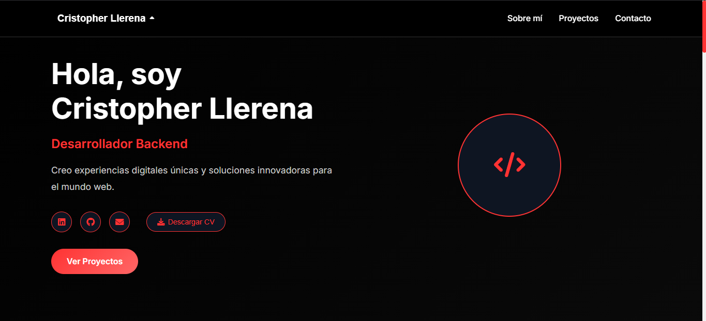

# 🚀 CodeByCris - Personal Web Portfolio



## 📋 Description

**CodeByCris** is a personal web portfolio developed by **Cristopher Llerena**, a young Front-End developer and future economist. This project presents a modern and responsive digital experience that showcases technical skills, projects, and professional experience.

## ✨ Main Features

### 🌍 **Multi-language**
- Complete support for **3 languages**: English, Spanish and Portuguese
- Dynamic language switching system without page reload
- Automatic translation of all interface elements

### 📱 **Responsive Design**
- Fully adaptive design for all devices
- Mobile navigation with hamburger menu
- Optimized for tablets, smartphones and desktop

### 🎨 **Modern Interface**
- Minimalist design with dark theme
- Smooth animations and hover effects
- Modern typography (Inter Font)
- Attractive gradients and visual effects

### ⚡ **Interactive Features**
- Smooth navigation between sections
- Entry animations with Intersection Observer
- Parallax effects in hero section
- Dynamic "Back to top" button
- Functional contact form

## 🛠️ Technologies Used

### **Frontend**
- **HTML5** - Semantic and accessible structure
- **CSS3** - Modern styles with Flexbox and Grid
- **JavaScript (ES6+)** - Interactive and dynamic functionality

### **Libraries and Resources**
- **Font Awesome** - Professional iconography
- **Google Fonts (Inter)** - Modern typography
- **Formspree** - Contact form processing

### **Technical Features**
- **Responsive Design** - Mobile-first approach
- **Progressive Web App** - Native application experience
- **SEO Optimized** - Meta tags and semantic structure
- **Accessibility** - ARIA labels and keyboard navigation

## 📁 Project Structure

```
mipaginaweb/
├── index.html          # Main page
├── styles.css          # CSS styles
├── script.js           # JavaScript functionality
├── README.md           # Project documentation
├── CV/                 # CV files directory
└── imagenes/           # Images directory
    └── portafolio.png  # Portfolio image
```

## 🚀 Installation and Usage

### **Prerequisites**
- Modern web browser (Chrome, Firefox, Safari, Edge)
- Local web server (optional, for development)

### **Installation Steps**

1. **Clone the repository**
   ```bash
   git clone https://github.com/NotchArth/mipaginaweb.git
   cd mipaginaweb
   ```

2. **Open the project**
   - Open `index.html` in your web browser
   - Or use a local server:
   ```bash
   # With Python
   python -m http.server 8000
   
   # With Node.js
   npx serve .
   ```

3. **Access the site**
   - Local: `http://localhost:8000`
   - Online: [https://notcharth.github.io/mipaginaweb](https://notcharth.github.io/mipaginaweb)

## 📱 Portfolio Sections

### **🏠 Hero Section**
- Personal presentation with typing animation
- Social media links
- CV download button
- Avatar with visual effects

### **👨‍💻 About Me**
- Personal and professional information
- Informative cards with iconography
- Skills and approach description

### **🛠️ Technologies**
- Categorization by areas: Frontend, Backend, Databases, Cloud
- Experience level indicators
- Representative icons for each technology

### **📂 Projects**
- Featured projects gallery
- Links to source code and demos
- Technical description of each project

### **📞 Contact**
- Functional contact form
- Personal contact information
- Professional social media links

## 🎯 Highlighted Features

### **Multi-language System**
```javascript
// Dynamic language change
function changeLanguage(lang) {
    const elements = document.querySelectorAll(`[data-${lang}]`);
    elements.forEach(element => {
        element.textContent = element.getAttribute(`data-${lang}`);
    });
}
```

### **Smooth Animations**
```javascript
// Smooth navigation
document.querySelectorAll('a[href^="#"]').forEach(anchor => {
    anchor.addEventListener('click', function (e) {
        e.preventDefault();
        document.querySelector(this.getAttribute('href'))
            .scrollIntoView({ behavior: 'smooth' });
    });
});
```

### **Responsive Navigation**
```javascript
// Mobile hamburger menu
const hamburger = document.querySelector('.hamburger');
const navMenu = document.querySelector('.nav-menu');

hamburger.addEventListener('click', () => {
    hamburger.classList.toggle('active');
    navMenu.classList.toggle('active');
});
```

## 🎨 Customization

### **Change Colors**
Edit CSS variables in `styles.css`:
```css
:root {
    --primary-color: #ff3333;
    --secondary-color: #ff6666;
    --background-color: #000000;
    --text-color: #ffffff;
}
```

### **Add New Languages**
1. Add option in language menu
2. Include `data-[language]` attributes in HTML elements
3. Update `changeLanguage()` function

### **Modify Content**
- Edit text in `index.html`
- Update personal information
- Add new projects in the corresponding section

## 📊 Project Statistics

- **Lines of code**: ~1,300
- **Technologies**: 3 (HTML, CSS, JavaScript)
- **Supported languages**: 3
- **Sections**: 6 main
- **Responsive breakpoints**: 4

## 🔗 Useful Links

- **Live Demo**: [https://notcharth.github.io/mipaginaweb](https://notcharth.github.io/mipaginaweb)
- **Repository**: [https://github.com/NotchArth/mipaginaweb](https://github.com/NotchArth/mipaginaweb)
- **LinkedIn**: [https://www.linkedin.com](https://www.linkedin.com)
- **GitHub**: [https://github.com/NotchArth](https://github.com/NotchArth)

## 👨‍💻 About the Developer

**Cristopher Llerena** is a 17-year-old Front-End developer, Software Engineering student and economics enthusiast. He combines technical skills with an innovative approach to create unique digital solutions.

### **Technical Skills**
- **Frontend**: HTML5, CSS3, JavaScript, React (learning)
- **Backend**: Node.js, Express.js, Java, Go (learning)
- **Databases**: MySQL, NoSQL (learning)
- **Cloud & Analytics**: AWS, Power BI (learning)

## 📄 License

This project is under the MIT License. You can use, modify and distribute freely.

## 🤝 Contributions

Contributions are welcome. To contribute:

1. Fork the project
2. Create a branch for your feature (`git checkout -b feature/AmazingFeature`)
3. Commit your changes (`git commit -m 'Add some AmazingFeature'`)
4. Push to the branch (`git push origin feature/AmazingFeature`)
5. Open a Pull Request

## 📞 Contact

- **Email**: cristopherxs178@gmail.com
- **GitHub**: [@NotchArth](https://github.com/NotchArth)
- **Instagram**: [@notch_arth](https://www.instagram.com/notch_arth)
- **Location**: Ecuador

---

⭐ **If you like this project, don't forget to give it a star on GitHub!**
